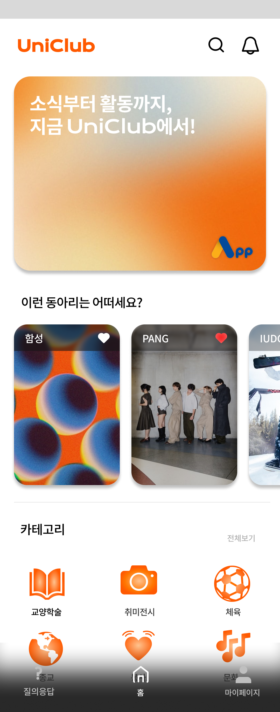
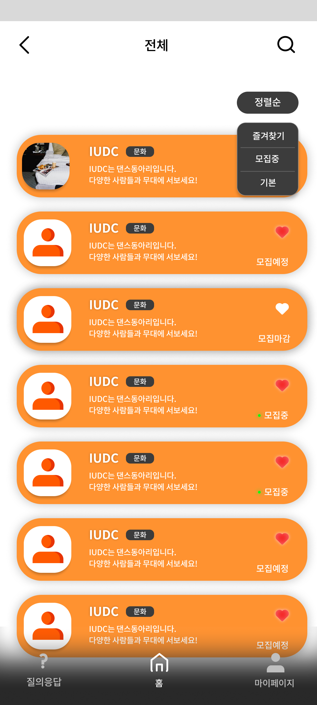
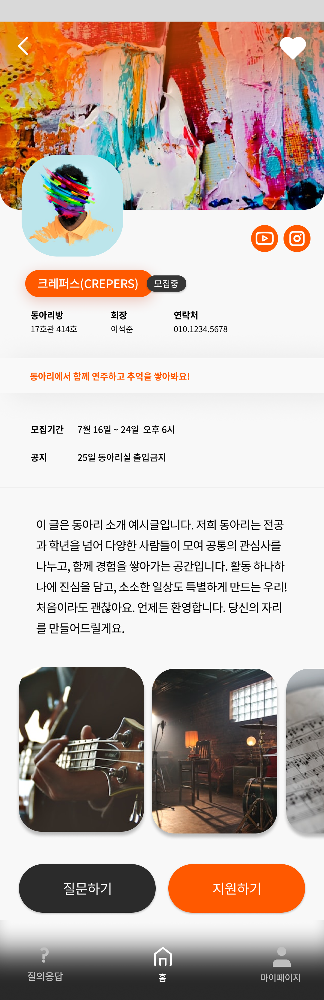
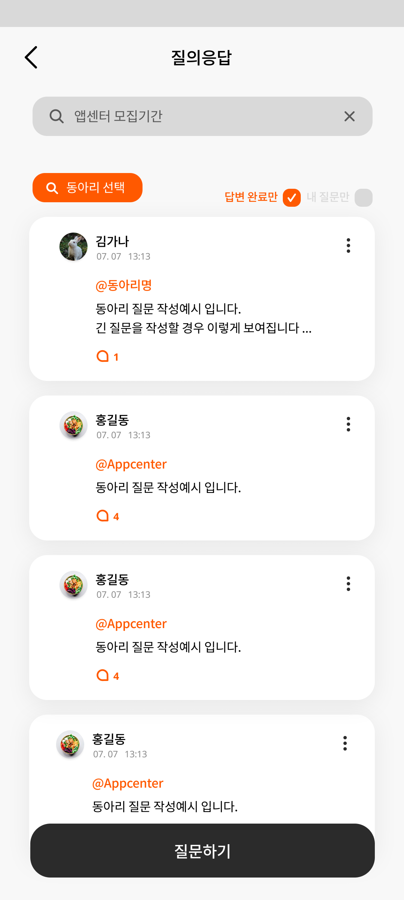
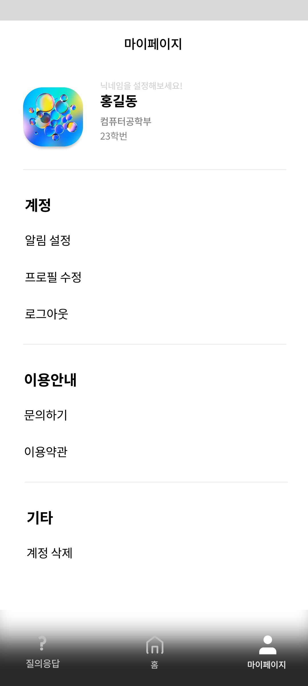

# UniClub

인천대학교 동아리 통합 플랫폼

동아리 모집, 홍보, 탐색 및 커뮤니티 기능을 제공하여 학생들이 교내 동아리 정보를 쉽고 편리하게 확인할 수 있도록 제작된 애플리케이션입니다.

Android, iOS, Server 파트 협업 프로젝트입니다.

---

## 프로젝트 소개

교내 동아리 정보를 한곳에서 확인하고 관리할 수 있는 플랫폼입니다.

사용자는 동아리 모집 공고를 확인하고, 관심 동아리를 탐색하며, Q&A 및 알림 기능을 통해 동아리와 소통할 수 있습니다.

---

## 주요 기능

### 회원

* 로그인 / 회원가입
* 재학생 인증

### 동아리 탐색

* 카테고리별 동아리 조회
* 동아리 검색
* 동아리 상세 정보 확인
* 관심 동아리 등록

### 동아리 홍보

* 모집 정보 조회
* 모집 상태 확인
* 활동 사진 조회
* SNS 및 지원 링크 연결

### 커뮤니티

* Q&A 기능
* 알림 기능

### 관리자

* 동아리 홍보 정보 등록 및 수정
* 모집 일정 관리
* 홍보 이미지 관리

---

## Android 구현 내용

* Jetpack Compose 기반 UI 구현
* MVVM 아키텍처 적용
* StateFlow 기반 상태 관리
* Navigation Compose 화면 구성
* Retrofit 기반 서버 통신
* DataStore 기반 토큰 관리
* 동아리 검색 및 필터링 기능
* 이미지 캐러셀 및 커스텀 UI 구현

---

## 기술 스택

### Android

* Kotlin
* Jetpack Compose
* ViewModel
* Navigation Compose
* StateFlow
* Coroutines

### Network

* Retrofit2
* OkHttp3
* Gson

### Storage

* DataStore

### Image

* Coil

---

## 프로젝트 구조

```text
ui/
 ├── home
 ├── promotion
 ├── qna
 ├── search
 ├── login
 ├── signup
 ├── notification
 ├── mypage
 └── components

network/
 ├── api
 └── dto

data/
di/
fcm/
util/
model/
```

---

## 실행 방법

```bash
git clone https://github.com/inu-appcenter/UniClub-android.git
```

* Android Studio에서 프로젝트 실행
* API 서버 설정 필요
* Emulator 또는 실제 기기에서 실행
  
---

## 화면

<p align="center">
  
  
  
  
  
</p>

<p align="center">
  <b>홈</b> &nbsp;&nbsp;&nbsp;&nbsp;
  <b>동아리 리스트</b> &nbsp;&nbsp;&nbsp;&nbsp;
  <b>홍보</b> &nbsp;&nbsp;&nbsp;&nbsp;
  <b>Q&A</b> &nbsp;&nbsp;&nbsp;&nbsp;
  <b>마이페이지</b>
</p>
